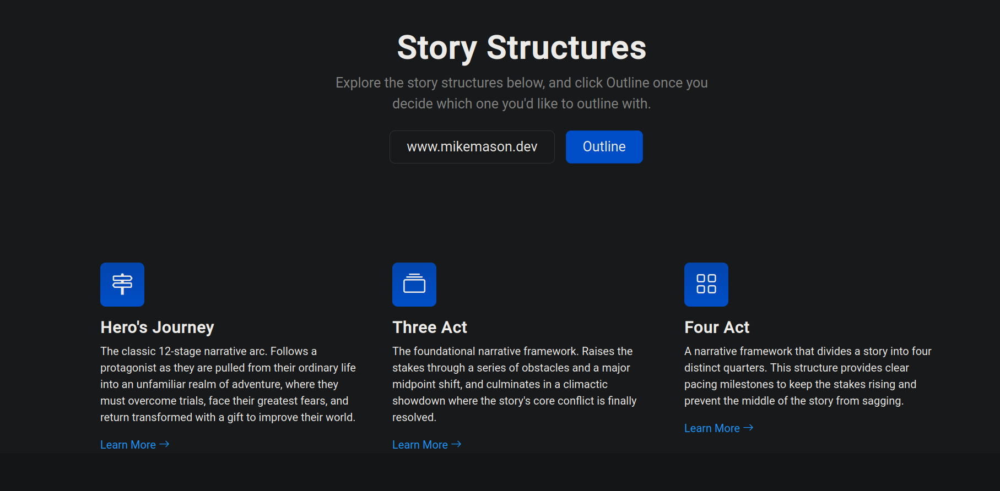
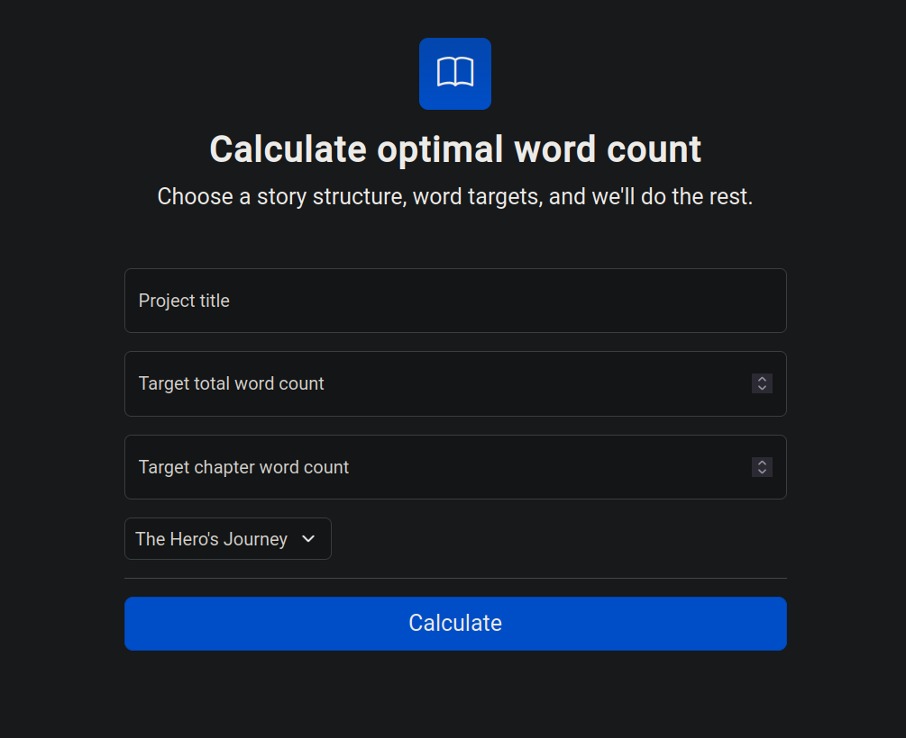

# Novel Outliner

A Spring Boot web application designed to help authors plan and structure their novels. By selecting a predefined story structure (like the Three-Act Structure) and entering a target total word count, the app automatically generates a detailed chapter-by-chapter outline with optimized word count targets for each narrative segment.

## Features

*   **Structure-Driven Outlining:** Automatically calculates target word counts for chapters based on classic storytelling frameworks.
*   **Dynamic Web Forms:** Powered by Thymeleaf to fetch available structures and instantly generate linked Chapter entities.
*   **Dual-Database Isolation:** Separates static story-structure templates from temporary user session data to maximize security and minimize storage bloat.
*   **Containerized Architecture:** Fully containerized development environment using Podman.

---

## Tech Stack

*   **Backend:** Java, Spring Boot (Spring MVC, Spring Data JPA)
*   **Frontend:** Thymeleaf, HTML5, CSS3
*   **Database:** PostgreSQL
*   **Containerization:** Podman

---

## Gallery

